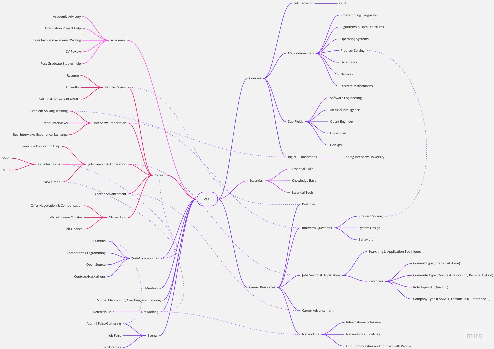

# Welcome to Active Courses University

ACU is an Open University primarily dedicated to preparing & working for Big Tech companies (FAANG, FAANG+, Fortune 500, enterprises, and startups) by providing Career Services, Resources (Roadmaps & MOOCs), Networking, and Academic Advisory for CS/CSE only.

**Note**: If you find current onboarding hard, please issue a ticket and explain.

The Mind Map is divided into right (for the resources) and left (for the services). Topics advance as you go from the top to the bottom. For a full explanation, check [ACU Mind Map Explanation](./README-Explanation.md).

## Contents

1. [Summary](#summary)
2. [Resources](#resources)
   1. [Courses](#courses)
      1. [CS-Fundamentals](#cs-fundamentals)
      2. [Sub-Fields](#sub-fields)
   2. [Essential](#essential)
   3. [Career Resources](#career-resources)
3. [Community](#community)
   1. [General](#general)
      1. [Rules](#rules)
      2. [Conversation Etiquette](#conversation-etiquette)
      3. [FAQ](#faq)
   2. [Roles Onboarding](#roles-onboarding)
   3. [Services Onboarding](#services-onboarding)
      1. [Academia](#academia)
      2. [Career](#career)
      3. [Sub-Communities](#sub-communities)
      4. [Networking](#networking)
      5. [Mutual Mentorship, Coaching and Tutoring](#mutual-mentorship-coaching-and-tutoring)
      6. [Mentorship](#mentorship)
      7. [Events](#events)
   4. [Channels & Categories Onboarding](#channels--categories-onboarding)
4. [About us](#about-us)
   1. [Board Of Leaders](#board-of-leaders)
   2. [Mentors](#mentors)
   3. [Curriculum Maintainers](#curriculum-maintainers)
   4. [Contributors](#contributors)

## Summary

Active Courses University is a community targeting to work in Big N. Similar to the [OSSU](https://github.com/ossu/computer-science) community, it provides educational resources. Additionally, ACU provides professional Career, Networking, and Academic Advisory services.

Similar to real universities, services are provided mostly by peers/students, and some by professionals (> 3 YoE). ACU members are all authentic members providing Services (Career Services, Academic Advisory, and much more in [Services Onboarding](#services-onboarding)).

For a full comparison between ACU and other servers, online communities, paid boot camps and real universities, Check [ACU Comparison](./README-Explanation.md#acu-comparison).

ACU Resources consist of three primary resources (OSSU, CS Fundamentals, and Big N SE Roadmaps) utilizing suggestions from Pioneer Software Engineers and other reliable sources. Further information is in [Resources](#resources).

If you like the idea, share it. You will benefit directly & indirectly. Your tutor, coach, mentor, or study buddy might be the colleague you invited or invited by him. Try to share it on your Twitter, Facebook, or class group, or ask someone famous to share it.

Check [Community](#community) to join us.

## Resources

### Courses

* To pick courses, check [Resources Explanation](./README-Explanation.md#resources) before you dive into any course.
* Notes:
  * Course reviews will be provided in the GitHub Issues soon.
  * A lot of courses are still not added here but are mentioned (Pinned in each channel, written in [OSSU](https://github.com/ossu/computer-science) or [Omar Shawky's CS-Roadmap](https://github.com/OmarShawky1/CS-Roadmap)) and will soon be merged.
  * Resources that will be enhanced and rewritten in our [Website](https://www.activecourses.tech/).

#### CS-Fundamentals

| Topic | Course Name |Topics Covered | Course Prerequisites | Course Reviews |
|:-|:-:|:-:|:-:|:-:|
| Introduction to Programming | [How to Code - Simple Data](https://www.edx.org/course/how-to-code-simple-data) & [How to Code - Complex Data](https://www.edx.org/course/how-to-code-complex-data)|

`programming concepts`, `basic function structure`, `functional programming`, `dynamic typing`
 `programming concepts`: (`lexical scoping`),  `basic function structure`: (Function signature, First Order Function)  `functional programming`: (Recursion, Mutual Recursion, Tail Recursion, High Order Function: {Function Consumer or passing function as argument}, `map`, `filter`, `fold`, Backtracking Search, Generative Recursion),  `dynamic typing`
| N/A | #TODO |
| $\uparrow$ | [Computer Science: Programming with a Purpose](https://www.coursera.org/learn/cs-programming-java) | 

`programming concepts`, `basic syntax`, `basic data structures`, `Functional Programming`, `OOP`
 `programming concepts`: (Abstraction, Decomposition, Standard Input & Output, Type Conversion, Type Checking, Functions, API, Modular Programming, Recursion, `dynamic programming`, `divide and conquer`, Memoization, Algorithmic Complexity, Abstract Datatypes, Compiler, Interpreter, Procedural Paradigm, Scripting Language, Special-Purpose Language),  `basic syntax`: (Variables, Variables Types, Arithmetic Operations, `if`, loops {`while`, `for`}, Nesting, Access Modifiers, Non-Access Modifiers, Static Methods),  `basic data structures`: (Primiteves, `string`, Arrays, kD Arrays),  `Functional Programming`,  `OOP`: (Methods, `inheritance`, Encapsulation)
|  N/A | #TODO |
| Programming Languages | [Programming Languages, Part A](https://www.coursera.org/learn/programming-languages), [Programming Languages, Part B](https://www.coursera.org/learn/programming-languages-part-b) & [Programming Languages, Part C](https://www.coursera.org/learn/programming-languages-part-c) which covers all topics in "Concepts of Programming Languages by Robert W. Sebesta 12th Edition" & "Programming Language Pragmatics by Michael Scott 4th edition"|

`programming concepts`, `functional programming`, `static typing`, `dynamic typing`, `ML-family languages (via Standard ML)`, `Lisp-family languages (via Racket)`, `OOP`, `Ruby`, `libraries`, `tools`
 `programming concepts`: (Mutation, References/Pointers, : {Pairs, Tuples, Records}, Polymorphism (Functional, OOP, Bounded), Datatype Binding, Type Inference (Implicit Typing, Explicit Typing), Weak Typing, Strong Typing, Duck Typing, Method Overriding, Dynamic Dispatch, Double Dispatch, Interpreter),  `programming paradigms`: (`functional programming`, `OOP`),  `functional programming`: (Recursion, Mutual Recursion, Tail Recursion, Shadowing, Case Expression (AKA Pattern Matching), High Order Function, `map`, `filter`, `fold`, `lexical scope`, `dynamic scope`, Stream, Lazy Evaluation, Eager Evaluation, Memoization, Tokenization, Subtyping {Functional Sutyping, OOP Sutyping}, Generics),  `ML-family languages (via Standard ML)`, `Lisp-family languages (via Racket)`, `OOP`,  `Ruby`: (Classes, Object State, Arrays, Blocks, Hashes & Ranges, Subclassing: {Inheritance in java}, Mixins),  `universal libraries`: (File Stream, I/O Stream, Math),  `tools`: (Read Evaluate Print Loop (REPL), Debugger)
| How to Code (Check OSSU for details) | #TODO |
| Introduction to Programming + Programming Languages + OOP + Problem-Solving | [Mastering 4 Critical Skills using C++ 17 by Prof. Mostafa Saad](https://www.udemy.com/course/cpp-4skills/)| 

`programming concepts`, `C++ concepts`, `basic syntax`, `basic data structures`, `data structures`, `OOP`, `functional programming`, `algorithm complexity notions`, `algorithms`, `universal libraries`, `basic OS`, `basic computer architecture`, `UML`, `SE practices`, `software engineering`, `advanced syntax`, `advanced c++`
 `programming concepts`: (Type Conversion, Polymorphism: {Upcasting, Downcasting}, Exception Handling: {`except`, `throw`, `noexcept`, `nothrow`}, Compiler, Linker, Procedural Paradigm),  `C++ concepts`: (Standard Input & Output, References/Pointers, STL, Headers & `includes`),  `basic syntax`: (Variables, Variables Types, Arithmetic Operations, `if`, Loops {`while`, `for`}, Nesting, Access Modifiers, Non-Access Modifiers: {`static`, `const`, `final`}, Functions & Methods),  `basic data structures`: (Primitives, `string`, Arrays {1D, 2D, kD}),  `data structures`: (Encapsulation Techniques: {Struct, Pairs, Tuples}, STL: {Templates, `queue`, Priority Queues, Deque, Stack, Iterators, References, Pointers}, Vectors: {1D, 2D, kD}, Sets, Multisets, `map`), `functional programming`: (Recursion),  `OOP`: (concepts: {Encapsulation, Abstraction, Data-Hiding, Decomposition, SOLID Principles, `inheritance`: {Abstract Class, Interface, Method Overriding, Method Overloading, Operator Overloading: {Unary, Subscript, Relational, Prefix, Postfix, Input, Output, Conversion, Assignment}}}, Class: {Constructor, Destructor, Copy Constructor, Delete Function, Initializer List}, Specifiers: {`final`, `static`, `friend`}),  `algorithm complexity notions`: (Problem Reduction),  `algorithms`: (`sorting`: {Count Sorting}),  `universal libraries`: (File Streams, I/O Stream),  `basic OS`: (Memory Stucture: {Stack, Heap}, Static Variables...),  `basic computer architecture`: (bits & bytes, 2's Compliment, Signed & Unsigned Numbers, Floating Points & Rounding Numbers, Numbers Conversion/Casting),  `UML`: (Class Diagram: {Association, Aggregation, Composition, Generalization, Multiplicity}),  `SE practices`: (MVP, CRUD Operations, MVC, Refactoring),  `software engineering`: (Coupling, Cohesion),  `advanced syntax`: (`variadic`, Fold Expressions, functors (High Order Function), Lambda Expressions),  `advanced c++`: (Move Semantics & Perfect Forwarding, Smart Pointers: {Unique Pointers, Shared Pointers, Weak Pointers}, Pointer to Pointer, Void Pointer, Function Pointer)| N/A | Premium and Udemy courses do not provide autograder, but you will directly interact with Prof himself in his Discord Channels. |
| DSA | [Princeton Algorithms Course Part 1](https://www.coursera.org/learn/algorithms-part1) & [Princeton Algorithms Course Part 2](https://www.coursera.org/learn/algorithms-part2) |

`sorting and searching`, `shortest paths`, `randomized algorithms`, `data compression`, `data structures`, `algorithm complexity notions`
 `sorting and searching`: <ul>Elementary sort: (Shell sort, Insertion sort, Selection sort)</ul> <ul>Mergesort</ul> <ul>Quicksort</ul> <ul>Binary Search</ul> <ul>Quick-Select</ul> <ul>3-Way partitioning</ul> <ul>Heapsort</ul> <ul>A\* Search</ul> <ul>Multi-Dimensional Search: (KdTree, Sweep Line Algorithm)</ul> <ul>Hash-Tables*</ul> <ul>Graph-Searching: (Depth-First Search, Breadth-First Search, Topological sort, Kosaraju-Sharir DFS Twice, Cycle Detection)  * Maxflow-Mincut-problem: (Ford-Fulkerson Algorithm)</ul> <ul>String Sorting: (Key-Indexed Sort, LSD Radix Sort, MSD Radix Sort, 3-way Radix Quicksort, Manber-Myers MSD Sort, Suffix Sort, (and tries DS below))</ul> <ul>String Searching: (Knuth-Morris-Pratt, Boyer-Moore Rabin-Karp)</ul> <ul>Substring Searching (AKA Pattern Matching, Regular Expression matching): (Prefix Matching, Suffix Matching, Longest Prefix, Palindrome and many more)</ul> `shortest paths`: <ul>Greedy Algorithms: (Kruskal's Algorithm, Prim's Algorithm, Dijkstra's Algorithm), Acyclic SP: (Seam-Carving)</ul> <ul>`dynamic programming` Algorithms: (Bellman-Ford's Algorithm, Dijkstra's Algorithm\*)</ul>`randomized algorithms`: (Shuffle sort),  `data compression`: (Run-length Encoding, Huffman Compression, LZW Compression, Burrows-Wheeler Algorithm, Shannon-Fano Algorithm)  `data structures`: <ul>Linear: (Array, ArrayList, LinkedList, Stack, Queue, Priority Queues, Deque)</ul> <ul>Symbol-Table: (Suffix Array, Trees*, Tries*, Hash-Tables*, Graphs*, Sets*)</ul> <ul>Trees: (Binary Search Trees, Binary Heap, 2-3 Trees, Red-Black Trees, B-Trees)</ul> <ul>Multi-Dimensional Trees: (Space-Partitioning Trees, Interval Search Tree)</ul> <ul>Hash-Tables: (Seperate Chaining: {Two-probe hashing}, Linear Probing: {Double Hashing, Cuckoo Hashing})</ul> <ul>Sets</ul> <ul>Graphs: (Directed Graphs, Undirected Graphs, Edge Weighted Graphs, Acyclic Graphs, Edge Weighted Directed Acyclic Graphs)</ul> <ul>Minimum Spanning Trees (MST)</ul> <ul>Flow-Network or Residual Network</ul> <ul>Tries: (R-way Tries, Ternary Search Tries, TST & R2 Hybrid Tries, Patricia Trie, Suffix Tree)</ul> <ul>Miscellaneous: (DFA (Deterministic Finite State Automaton)), NFA (Nondeterminstic Finite State Automaton)</ul> `algorithm complexity notions`: (Problem Reduction, Linear programming, simplex algorithm, P, NP, CoNP, NP-Hard, Intractable)
| Basic knowledge with programming languages and OOP | [DSA Review](https://github.com/OmarShawky1/ACU/issues/1) |
| Operating Systems | [UW-Madison CS-537: Introduction to Operating Systems](https://pages.cs.wisc.edu/~remzi/Classes/537/Fall2021/) (Based on [Operating Systems: Three Easy Pieces](https://pages.cs.wisc.edu/~remzi/OSTEP/)) |

 `OS Algorithms`, `Virtualization`, `Concurrency`, `Memory`,`RAIDs`, `File Systems`, `Journaling`, `Crash Consistency`
  `OS Algorithms`: (`Scheduling Algorithms`, `Page Replacement Algorithms`, `Disk Scheduling Algorithms`, `Memory`),  `Virtualization`: (`CPU Virtualization`, `Memory Virtualization`),  `Concurrency`: (`Processes`, `Threads`, `Locks`, `Semaphores`, `Event-based Concurrency`),  `Memory`: (`Segmentation`, `Paging`, `TLB`, `Swap Space`, `Condition Variables`, `Disks`),  `RAIDs`, `File Systems`, `Journaling`, `Crash Consistency`
|C Programming Language, Computer Architecture Concepts | #TODO |
| Database Systems | [CMU 15-445/645: Database Systems](https://15445.courses.cs.cmu.edu/fall2023/) | 

`Data Models`, `Storage Models`, `Query Languages`, `Storage Architectures`, `Indexing`, `Transaction Processing`, `Recovery`, `Query Processing`, `Parallel Architectures`
  `Data Models`: (Relational, Document, Key/Value),  `Storage Models`: (N-ary, Decomposition),  `Query Languages`: (SQL, Stored Procedures),  `Storage Architectures`: (Heaps, Log-Structured),  `Indexing`: (Order Preserving Trees, Hash Tables),  `Transaction Processing`: (ACID, Concurrency Control),  `Recovery`: (Logging, Checkpoints),  `Query Processing`: (Joins, Sorting, Aggregation, Optimization),  `Parallel Architectures`: (Multi-core, Distributed)
 |C++ Programming Language, Operating Systems| #TODO |

#### Sub-Fields

To be done...

### Essential

* Before diving into the following resources, you can first check "What they are about" from [Essential Explanation](./README-Explanation.md#essential).

1. Essential skills:
   1. How to ask questions?
      1. [Dr. Mostafa's advice on how to ask (Arabic)](https://www.youtube.com/watch?v=PxLOqb54omI).
      2. Watch [Coursera's "Getting Help" video](https://www.coursera.org/lecture/data-scientists-tools/getting-help-dhpW3).
      3. Read [Stack Overflow "How to ask"](https://stackoverflow.com/help/how-to-ask).
      4. Read [FreeCodeCamp's "How to ask good questions" article](https://www.freecodecamp.org/news/how-to-ask-good-technical-questions/).
      5. Read about [XY Problem](https://mywiki.wooledge.org/XyProblem).
      6. Ask a binary question if possible. (I.e., True/false)
      7. If not, Ask the enclosed question if possible. (I.e., the question that has an expected answer; E.g., Which color? "Red", "Green", "Blue")
      8. If not, ask open questions and supply atomic information in an enumerated form. (E.g., "How to study Algorithms?" 1. I know math. 2. I know Programming Languages.)
      9. Note: Atomic information is the simplest form of information possible that can not be further broken down into even simpler data and can never hold more than a single meaning.
   2. Who to ask before you ask?
      1. Only reliable person that is in charge, or has been in charge, or reached the end of the road you want to take.
      2. Never rely on an answer/course even if it is free before performing rule 1 above.
      3. Arabic shorts & videos:
         1. Dr. Mostafa: Video [1](https://www.youtube.com/live/ZHMr5kPjFpk?feature=share) & [2](https://www.youtube.com/live/8pSt7yhkfSw?feature=share).
         2. Mr. Moshrif: Video [1](https://www.facebook.com/watch/?v=1453088708370995).
   3. How to study and not forget what you studied? Use Obsidian (using Zettlekasten & Wikipedia styles)
   4. What is your opinion about X/Y/Z Course?
      1. Arabic:
         1. Mr. Moshrif: Video [1](https://www.facebook.com/watch/live/?ref=watch_permalink&v=553205550240384) & [2](https://fb.watch/jKaKqf2Rjq/). [Post](https://www.facebook.com/mmoshrif/posts/pfbid02gNUwraX2rJdykh2c6XXeAqKBh3ucdo7YcLx5qeHRqm87NywW769VavTTmZ197Hmdl).
         2. Dr. Mostafa: Video [1](https://www.youtube.com/live/jJoVVCfDCN4).
   5. How do you plan and solve most of your problems (in life and the field or industry) smartly with the least thinking effort and minimize failures?
      1. Check "How to ask?" above.
      2. Check related records or background about who is giving you the advice. If he is advising on "How to work at Google?" he must have worked there at least.
      3. Avoid unaccountable advice or courses from unreliable people, even if they are free. Unless a person is accountable for what he says and has an active track record, treat every word with a grain of salt.
      4. For you to ask someone, you need to build a relationship with them. You also might need to show that you also help when you can, as this will increase the chances of getting help.
      5. Firmly believing that you are not exceptional by any means. 99.99% of your problems have faced others as well, and they developed a solution for them, but you just didn't research enough.
2. Essential tools: git-and-github (in [ACU-English channel](https://discord.com/channels/1026170883997438112/1026170885331222549) or [ACU-Arabic channel](https://discord.com/channels/950993900720492574/951580791316574248)) & Linux (in [ACU-English channel](https://discord.com/channels/1026170883997438112/1026170885331222550) or [ACU-Arabic channel](https://discord.com/channels/950993900720492574/951580813756088380)).
3. Knowledge Base:
   1. @Students: recommended forum (in [ACU-English](https://discord.com/channels/1026170883997438112/1176582261433434112) or [ACU-Arabic](https://discord.com/channels/950993900720492574/1059712714492088370)).
   2. For @Trusted: knowledge base forum (in [ACU-English](https://discord.com/channels/1026170883997438112/1176589702334267504) or [ACU-Arabic](https://discord.com/channels/950993900720492574/1075739383908552794)).

### Career Resources

* For the explanation, check [Career Resources Explanation](./README-Explanation.md#career-resources).

1. You can find them in [Channels & Categories Onboarding](#channels--categories-onboarding).

## Community

* This section is for onboarding.
* Join  

<!--
[Old Arabic Onboarding Video](https://youtu.be/v1SyedPG0jw)
Old AC server logo
Arabic Server: .
-->

### General

#### Rules

1. **Do not waste your efforts** on rude people; Don't try to respond to bullying or any rude text, please mention @Moderator.
2. **Hateful discussion is prohibited**, and you will be banned forever.
   1. The Server has 0% tolerance against contentions like **Religious** Disputes/Curses, **Politics**, **Sexism**, and NSFW Content (Curses or Images).
   2. Never do "Character assassination". Even for a person who isn't on the server.
   3. You are allowed to criticize respectfully & objectively. E.g., You can claim a course to be a "Scam" (only If you have proof) but you are not allowed to curse its instructor.
3. Do not give advice when you are not eligible. For example:
   1. Do not tell anyone "How to become a good Software Engineer" unless you are reciting from a credible source, or you have 5+ years of experience.
   2. Do not say "This resume advice is wrong" unless you have a contradicting credible source, or you are a recruiter/hiring manager (at the same companies that the person is talking about).

#### Conversation Etiquette

1. If talking needs more than 2 replies, you **must open a thread**.
2. If you ask a question, **be responsive to answers**.
3. **Never ask the same question twice**.
4. **Never ask before doing your research & showing it**.
5. **Don't mention** people (E.g., @omar1111) or DM unless they are comfortable with it. (ESPECIALLY **@Mentors**)
6. Don't ask to ask; Ask right away.

#### FAQ

1. How to use Discord:
   1. Arabic: [New Video](https://youtu.be/oUh1ve_dS4I) or [Old Video](https://youtu.be/QMkqUMoYInE).
   2. Tips:
      1. You can show/hide channels from "Browse Channels" options on the left pane.
2. Can't find a study buddy or anyone to help in a course?
    1. Have you tried your best to share this server in all the communities that you are in?
    2. Did you try to ask on the server for anyone who knows someone who is studying course X?
3. Read [Essential](#essential).

### Roles Onboarding

1. Students (@Students):
   1. Who are @Students: Authentic admitted people who applied using one of the authentication methods in the newcomer channel in the Discord server.
   2. What are their benefits?
      1. Find tutors for the entire right side of the aforementioned Mind Map.
      2. Ask mentors.
      3. Have access to "life-after-grad" channel which provides help with ACU Services (everything on the left side of the aforementioned Mind Map) and "internships" channel.
   3. **IMPORTANT NOTE**: All the benefits are limited. For example, people asking questions in Princeton Algorithms Part 1 Week 6 will help people in Week 5, and the hierarchy goes on. The student receives a single warning if they do not offer help as they were helped. The second time, he is banned. (Reason in [Members Explanation](./README-Explanation.md#members))
2. Trusted (@Trusted):
   1. Who are @Trusted? People supporting the community. They are nominated by 2+ @Trusted.
   2. What are their benefits?
      1. Have access to the entire ACU Services in the Discord Server.
      2. They have full access to exclusive content and resources that are available only to individuals in this role.
   3. How to be @Trusted?
      1. Think of being @Student as an interview. Each question or help tells @Trusted more about you.
      2. Support the community as much as you can; Ask "How can I help the community?" or infer it.
      3. Provide ideas, resources and help. Check channels where you can provide help. Ask us to create one if it is missing.
      4. Find and collaborate with people with mutual interests. For example:
         1. Find people applying for internships (in [ACU-English](https://discord.com/channels/1026170883997438112/1176583002281738301) or [ACU-Arabic](https://discord.com/channels/950993900720492574/1154362703935184956)) or applying for full-time jobs life-after-grad (in [ACU-English](https://discord.com/channels/1026170883997438112/1026170885331222553) or [ACU-Arabic](https://discord.com/channels/950993900720492574/992733648690368512)).
         2. Help people with their resumes in life-after-grad (in [ACU-English](https://discord.com/channels/1026170883997438112/1026170885331222553) or [ACU-Arabic](https://discord.com/channels/950993900720492574/992733648690368512)).
3. *Special Roles*: Only explained in Discord under their category.
4. Mentor (@Mentor): An expert (with 5+ years of experience) who is open to providing mentorship.

### Services Onboarding

* For the explanation, check [Services Explanation](./README-Explanation.md#services)

#### Academia

* For the explanation, check [Academia Explanation](./README-Explanation.md#academia).

Currently, no dedicated channels for it, but most people will answer you. For example, you can ask about graduation projects or CVs life-after-grad (in [ACU-English](https://discord.com/channels/1026170883997438112/1026170885331222553) or [ACU-Arabic](https://discord.com/channels/950993900720492574/992733648690368512)).

#### Career

* For the explanation, check [Career Explanation](./README-Explanation.md#career).
* Anything between quotes means a node in the aforementioned mind map.
* Career Services are carried out in the following places.

1. life-after-grad channel: For @Students to discuss "Career" except "Problem Solving Training".
2. *SPECIAL CATEGORY*: For @*Special Roles* to discuss "Career Advancement" and "Discussions".
3. SUB-COMMUNITIES:
   1. Open Source Programs (Name of Community):
      1. general-osi channel.
      2. vacancies-osi channel.
   2. New Grads (Name of Community): CAREER Category.
4. CAREER Category:
   1. For @Trusted to discuss "Problem-Solving Training", "Profile Review", "Interview Preparation", and "Job Search & Application".
   2. Partially for @Students to discuss "Problem-Solving Training" and search & apply together (mutually apply) to internships.

#### Sub-Communities

* For the explanation, check [Sub-Communities Explanation](./README-Explanation.md#sub-communities).

They are all carried out in SUB-COMMUNITIES.

#### Networking

* For the explanation, check [Networking Explanation](./README-Explanation.md#networking)

1. @Students networking options are limited to studying channels and general mentorship (in the category MENTORSHIP).
2. @Trusted networking options are like @Students but extend to their exclusive channels.
3. For beginners, pick an interactive channel where you can collaborate with others. internships, ps-grinding. For more advanced members, tackle questions in Q&A, especially life-after-grad.

#### Mentorship

Provided only under the "MENTORSHIP" Category.

### Mutual Mentorship, Coaching and Tutoring

* For the explanation, check [Mutual Mentorship, Coaching and Tutoring](./README-Explanation.md#mutual-mentorship-coaching-and-tutoring).

No dedicated channel. Provided throughout the entire server.

#### Events

* For the explanation, check [Events Explanation](./README-Explanation.md#events).

Third-party events are available only on the Arabic ACU Server in recommended events.

## Channels & Categories Onboarding

* Brief & ordered from top to bottom.
* Not all channels are mentioned to avoid redundancy.
* All channels mentioned are just for @Students (which is 40% of the entire server).
* Always check pinned messages.

1. COMMUNITY:
   1. announcements: Any major updates in the server. @everyone tag is only used for important announcements.
   2. ask-mod: Used for newbies or issues within the server or moderators.
   3. server-suggestions: Things you wish in the server.
2. NEWCOMER:
   1. entry-rules: Rules to apply as @Student.
   2. entry: Where you apply or grant people.
   3. general-newcomers: Used by members who do not want to enroll and keep anonymous. Further similar channels will be added if there is traffic that requires anonymity.
3. MENTORSHIP
   1. mentors-announcements: All mentors announcements.
4. *SPECIAL CATEGORY*: This is not the name of the category but some set of categories that have the following similar channels:
   1. *general*: Place for members to get answers from all *special roles* members.
   2. *side-channel*: Like "general" above but requires just one answer.
   3. knowledge-base: Stackoverflow-like for resources between members.
5. SOCIAL:  
   1. off-topic: For non-cs type of questions (E.g., ask for opinions, what is Gen-Ed?...).
6. GENERAL: Channels that do not fit anywhere else.
   1. recommended: Stackoverflow-like resources for @Students.
   2. recommended-events: Suggested events that are not organized by ACU (the Miscellaneous events in MidMap above).
   3. general-questions: Topic-less Q&A.
   4. life-after-grad: Topic-less Q&A but for graduation year (E.g., graduation project) and beyond (E.g., resume review).
7. From CORE PROGRAMMING to CORE SYSTEMS: Categories ordered after OSSUs' curriculum. Contains *general* channel for each topic (in OSSUs' curriculum) and a specific channel for each course covering the same topic (E.g., general-dsa & princeton-algo-part1). You can study OSSUs' courses here or there in addition to ACU SE-oriented courses.
8. CS-SUB-FIELDS: For CS-minors.
   1. general-cs-subfields: For CS-minors that have low traffic.
   2. general-ai
9. STACKS & TECHNOLOGIES: For cs-minors stacks but currently has SE-stacks.
    1. general-stacks-and-technologies: Mainly to ask about multiple domains at once and to discuss stacks of low traffic (do not currently have dedicated channel).
10. SUB-COMMUNITIES: For Communities that do not require more than 2 channels for discussions.
    1. Open Source Programs (Name of Community).
       1. general-osp: Topic-less discussions about Open Source Internships like "How to prepare".
       2. gsoc: General discussions about Google Summer of Code.
11. CAREER: For career-specific preparation topics. For general discussions (E.g., Offer negotiation), go to life-after-grad or *general* (for *specific roles*).
    1. ps-grinding: Accelerate studying problem-solving by studying for others to increase commitment level. Similar to mock interviews, except that each pair of people decides their terms (E.g., no camera, no voice communication...). In other words, it is half-mock-interviews.
    2. mock-interviews: Schedule mock-interviews between @Trusted only. Ask for a random mock or prepare before an interview (mock all day).
    3. internships: Share and discuss internship options, application process, and tips between @Students.
    4. vacancies: Applications resources. Each application has a link and useful information (Company, Job, recruiters and hiring managers) to further facilitate your application chances.
    5. mutual-apply: Apply together at the same time to the same vacancy.
12. ARCHIVE: Old channels replaced with way/channels of doing things or that does not have traffic anymore (E.g., gsoc is seasonal)

## About us

### Board Of Leaders

|  

Omar Shawky
 <small>ACU Creator    |
|:-:|

### Mentors

|

Abdelhalim Zaki
 <small>DevOps Mentor</small>   
|
|:-:|

### Curriculum Maintainers

|  

Omar Shawky
 <small>ACU Creator    |  

Abdallah Ahmed
 <small>Curriculum Maintainers</small>    |
|:-:|:-:|

### Contributors

|  

Omar Shawky
 <small>ACU Creator    |  

Abdallah Ahmed
 <small>Curriculum Maintainers</small>     | 

Mohammed A. Gomma
 <small>Community Moderator  |

Hussein Hany
<small>Community Moderator</small>    
|:-:|:-:|:-:|:-:|
|

Abdulrahman Al-Ghamdi
<small>Community Moderator</small>  |

Abdullah Elhadad
<small>Community Moderator</small>  |

Mohammed Ashraf
<small>Community Moderator</small>  |

Ramadan Yassin
<small>Community Moderator</small>  |
<article>

Ali Kehel
<small>Website Maintainer |

Abdoo Nasser
<small>Community Moderator</small>  |
