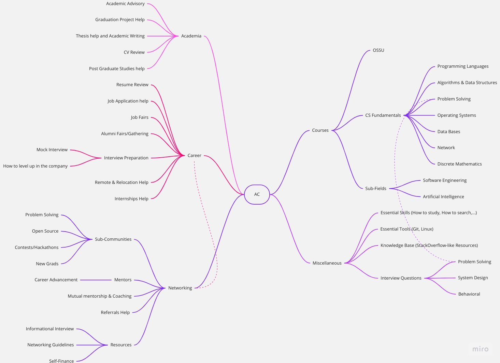

# ACU

An Open University primarily dedicated to preparing & working for Big Tech companies (FAANG, FAANG+, Fortune 500, Enterprises, Startups) by providing Career Services, Resources (Roadmaps & MOOCs), Networking and Academic Advisory for CS/CSE only.

**Note**: **English Server is coming soon**. If you find current onboarding hard, please issue a ticket and explain.

## ACU Mind Map

For a full explanation, check [ACU Mind Map Explanation](./ACU-Mind-Map-Explanation.md).

## Contents

1. [Summary](#summary)
2. [Resources](#resources)
   1. [Courses](#courses)
      1. [CS-Fundamentals](#cs-fundamentals)
      2. [Sub-Fields](#sub-fields)
   2. [Essential](#essential)
   3. [Career Resources](#career-resources)
3. [Community](#community)
   1. [General Info](#general-info)
      1. [Rules](#rules)
      2. [Conversation Etiquette](#conversation-etiquette)
      3. [Roles](#roles)
      4. [FAQ](#faq)
   2. [Academia](#academia)
   3. [Career](#career)
   4. [Networking](#networking)
   5. [Server Details](#server-details)
      1. [General](#general)

## Summary

Active Courses University is a community targeting to work in Big N. Similar to the [OSSU](https://github.com/ossu/computer-science) community, it provides educational resources. Additionally, ACU provides professional Career, Networking, and Academic Advisory services.

ACU Resources are mainly composed of three main resources (OSSU, CS Fundamentals, and Big N SE Roadmaps). Similar to real universities, services are provided mostly by peers/students, and some by professionals (>3 YoE).

The resources utilize OSSUs' curriculum, suggestions from Software Engineer Pioneers, and other reliable sources. (Check [ACU Mind Map Explanation](./ACU-Mind-Map-Explanation.md) for details)

ACU members are all authentic members providing free Career Services, Academic Advisory, mutual coaching, mutual mentorship, mutual tutoring, and much more. To Illustrate some tangible benefits for just the Mutual Tutoring:

1. Students typically get 1-3 answers within 5 minutes of their questions.
2. Students provide reviews and good resources after finishing a topic, in an iterative manner, leading to a curated educational resource after some time.
3. Students evade mistakes as others will guide them; For example, studying without taking notes and studying from interactive courses.

For a full comparison between ACU and other servers, online communities, paid boot camps and real universities, Check [ACU Comparison](./ACU-Mind-Map-Explanation.md#acu-comparison).

ACU is looking to expand current services to support everything like real universities. This can only be done via each member's contribution, suggestions, and services. Community is built on a single principle, "Those Who want help, give help"; Beneficiaries from such services shall try, with all they have, to support and contribute back to the community.

Currently, almost all services in the Mind Map are limited to Trusted members on the server. But don't worry, because you can be @Trusted by contributing to the community.

Finally, if you like the server/repository, share it or invite your acquaintances and colleagues. You will benefit directly and indirectly; your tutor, coach, mentor or study buddy might be your colleague you invited or a person that your colleague invited. Try to share it on your FB, class group (E.g., WhatsApp group). If you can ask someone popular to share this group; Do it.

Check [Community](#community) to join us.

## Resources

### Courses

* All courses follow IEEE CS2013 Guidelines (Check OSSU) while being free and interactive (autograder for assignments and final project/exam). The only exception is "Big N SE Roadmap".
* Notes:
  * Course reviews will be provided in the GitHub Issues soon.
  * Resources that will be enhanced and rewritten in our [Website](https://www.activecourses.tech/).
* Students are free to choose whichever course they like, but some benefits are studying from the same source as others as follows:
  * This is the servers' purpose (mentoring each other as our questions will be around the same course, and it will be easier to find an answer); Otherwise, Won't be any different from Coursera's Discussion forum which doesn't help much and takes time for your question to be answered.
  * Collected efforts (for picking a specific course objectively) will cover blind spots that each one has, and it will be likely better than each one picking his course & wasting efforts on course comparison.

Mainly [OSSU](https://github.com/ossu/computer-science) and secondarily [Omar Shawky's CS-Roadmap](https://github.com/OmarShawky1/CS-Roadmap) and pinned messages in the Discord server (which will soon be merged and rewritten to accommodate other CS Sub-Fields such as SWE).

#### CS-Fundamentals

| Topic | Course Name |Topics Covered | Course Prerequisites | Course Reviews |
|:-|:-:|:-:|:-:|:-:|
| Introduction to Programming | [How to Code - Simple Data](https://www.edx.org/course/how-to-code-simple-data) & [How to Code - Complex Data](https://www.edx.org/course/how-to-code-complex-data)|

`programming concepts`, `basic function structure`, `functional programming`, `dynamic typing`
 `programming concepts`: (`lexical scoping`),  `basic function structure`: (Function signature, First Order Function)  `functional programming`: (Recursion, Mutual Recursion, Tail Recursion, High Order Function: {Function Consumer or passing function as argument}, `map`, `filter`, `fold`, Backtracking Search, Generative Recursion),  `dynamic typing`
| N/A | #TODO |
| $\uparrow$ | [Computer Science: Programming with a Purpose](https://www.coursera.org/learn/cs-programming-java) | 

`programming concepts`, `basic syntax`, `basic data structures`, `Functional Programming`, `OOP`
 `programming concepts`: (Abstraction, Decomposition, Standard Input & Output, Type Conversion, Type Checking, Functions, API, Modular Programming, Recursion, `dynamic programming`, `divide and conquer`, Memoization, Algorithmic Complexity, Abstract Datatypes, Compiler, Interpreter, Procedural Paradigm, Scripting Language, Special-Purpose Language),  `basic syntax`: (Variables, Variables Types, Arithmetic Operations, `if`, loops {`while`, `for`}, Nesting, Access Modifiers, Non-Access Modifiers, Static Methods),  `basic data structures`: (Primiteves, `string`, Arrays, kD Arrays),  `Functional Programming`,  `OOP`: (Methods, `inheritance`, Encapsulation)
|  N/A | #TODO |
| Programming Languages | [Programming Languages, Part A](https://www.coursera.org/learn/programming-languages), [Programming Languages, Part B](https://www.coursera.org/learn/programming-languages-part-b) & [Programming Languages, Part C](https://www.coursera.org/learn/programming-languages-part-c) which covers all topics in "Concepts of Programming Languages by Robert W. Sebesta 12th Edition" & "Programming Language Pragmatics by Michael Scott 4th edition"|

`programming concepts`, `functional programming`, `static typing`, `dynamic typing`, `ML-family languages (via Standard ML)`, `Lisp-family languages (via Racket)`, `OOP`, `Ruby`, `libraries`, `tools`
 `programming concepts`: (Mutation, References/Pointers, : {Pairs, Tuples, Records}, Polymorphism (Functional, OOP, Bounded), Datatype Binding, Type Inference (Implicit Typing, Explicit Typing), Weak Typing, Strong Typing, Duck Typing, Method Overriding, Dynamic Dispatch, Double Dispatch, Interpreter),  `programming paradigms`: (`functional programming`, `OOP`),  `functional programming`: (Recursion, Mutual Recursion, Tail Recursion, Shadowing, Case Expression (AKA Pattern Matching), High Order Function, `map`, `filter`, `fold`, `lexical scope`, `dynamic scope`, Stream, Lazy Evaluation, Eager Evaluation, Memoization, Tokenization, Subtyping {Functional Sutyping, OOP Sutyping}, Generics),  `ML-family languages (via Standard ML)`, `Lisp-family languages (via Racket)`, `OOP`,  `Ruby`: (Classes, Object State, Arrays, Blocks, Hashes & Ranges, Subclassing: {Inheritance in java}, Mixins),  `universal libraries`: (File Stream, I/O Stream, Math),  `tools`: (Read Evaluate Print Loop (REPL), Debugger)
| How to Code (Check OSSU for details) | #TODO |
| Introduction to Programming + Programming Languages + OOP + Problem-Solving | [Mastering 4 Critical Skills using C++ 17 by Prof. Mostafa Saad](https://www.udemy.com/course/cpp-4skills/)| 

`programming concepts`, `C++ concepts`, `basic syntax`, `basic data structures`, `data structures`, `OOP`, `functional programming`, `algorithm complexity notions`, `algorithms`, `universal libraries`, `basic OS`, `basic computer architecture`, `UML`, `SE practices`, `software engineering`, `advanced syntax`, `advanced c++`
 `programming concepts`: (Type Conversion, Polymorphism: {Upcasting, Downcasting}, Exception Handling: {`except`, `throw`, `noexcept`, `nothrow`}, Compiler, Linker, Procedural Paradigm),  `C++ concepts`: (Standard Input & Output, References/Pointers, STL, Headers & `includes`),  `basic syntax`: (Variables, Variables Types, Arithmetic Operations, `if`, Loops {`while`, `for`}, Nesting, Access Modifiers, Non-Access Modifiers: {`static`, `const`, `final`}, Functions & Methods),  `basic data structures`: (Primitives, `string`, Arrays {1D, 2D, kD}),  `data structures`: (Encapsulation Techniques: {Struct, Pairs, Tuples}, STL: {Templates, `queue`, Priority Queues, Deque, Stack, Iterators, References, Pointers}, Vectors: {1D, 2D, kD}, Sets, Multisets, `map`), `functional programming`: (Recursion),  `OOP`: (concepts: {Encapsulation, Abstraction, Data-Hiding, Decomposition, SOLID Principles, `inheritance`: {Abstract Class, Interface, Method Overriding, Method Overloading, Operator Overloading: {Unary, Subscript, Relational, Prefix, Postfix, Input, Output, Conversion, Assignment}}}, Class: {Constructor, Destructor, Copy Constructor, Delete Function, Initializer List}, Specifiers: {`final`, `static`, `friend`}),  `algorithm complexity notions`: (Problem Reduction),  `algorithms`: (`sorting`: {Count Sorting}),  `universal libraries`: (File Streams, I/O Stream),  `basic OS`: (Memory Stucture: {Stack, Heap}, Static Variables...),  `basic computer architecture`: (bits & bytes, 2's Compliment, Signed & Unsigned Numbers, Floating Points & Rounding Numbers, Numbers Conversion/Casting),  `UML`: (Class Diagram: {Association, Aggregation, Composition, Generalization, Multiplicity}),  `SE practices`: (MVP, CRUD Operations, MVC, Refactoring),  `software engineering`: (Coupling, Cohesion),  `advanced syntax`: (`variadic`, Fold Expressions, functors (High Order Function), Lambda Expressions),  `advanced c++`: (Move Semantics & Perfect Forwarding, Smart Pointers: {Unique Pointers, Shared Pointers, Weak Pointers}, Pointer to Pointer, Void Pointer, Function Pointer)| N/A | Premium and Udemy courses do not provide autograder, but you will directly interact with Prof himself in his Discord Channels. |
| DSA | [Princeton Algorithms Course Part 1](https://www.coursera.org/learn/algorithms-part1) & [Princeton Algorithms Course Part 2](https://www.coursera.org/learn/algorithms-part2) |

`sorting and searching`, `shortest paths`, `randomized algorithms`, `data compression`, `data structures`, `algorithm complexity notions`
 `sorting and searching`: <ul>Elementary sort: (Shell sort, Insertion sort, Selection sort)</ul> <ul>Mergesort</ul> <ul>Quicksort</ul> <ul>Binary Search</ul> <ul>Quick-Select</ul> <ul>3-Way partitioning</ul> <ul>Heapsort</ul> <ul>A\* Search</ul> <ul>Multi-Dimensional Search: (KdTree, Sweep Line Algorithm)</ul> <ul>Hash-Tables*</ul> <ul>Graph-Searching: (Depth-First Search, Breadth-First Search, Topological sort, Kosaraju-Sharir DFS Twice, Cycle Detection)  * Maxflow-Mincut-problem: (Ford-Fulkerson Algorithm)</ul> <ul>String Sorting: (Key-Indexed Sort, LSD Radix Sort, MSD Radix Sort, 3-way Radix Quicksort, Manber-Myers MSD Sort, Suffix Sort, (and tries DS below))</ul> <ul>String Searching: (Knuth-Morris-Pratt, Boyer-Moore Rabin-Karp)</ul> <ul>Substring Searching (AKA Pattern Matching, Regular Expression matching): (Prefix Matching, Suffix Matching, Longest Prefix, Palindrome and many more)</ul> `shortest paths`: <ul>Greedy Algorithms: (Kruskal's Algorithm, Prim's Algorithm, Dijkstra's Algorithm), Acyclic SP: (Seam-Carving)</ul> <ul>`dynamic programming` Algorithms: (Bellman-Ford's Algorithm, Dijkstra's Algorithm\*)</ul>`randomized algorithms`: (Shuffle sort),  `data compression`: (Run-length Encoding, Huffman Compression, LZW Compression, Burrows-Wheeler Algorithm, Shannon-Fano Algorithm)  `data structures`: <ul>Linear: (Array, ArrayList, LinkedList, Stack, Queue, Priority Queues, Deque)</ul> <ul>Symbol-Table: (Suffix Array, Trees*, Tries*, Hash-Tables*, Graphs*, Sets*)</ul> <ul>Trees: (Binary Search Trees, Binary Heap, 2-3 Trees, Red-Black Trees, B-Trees)</ul> <ul>Multi-Dimensional Trees: (Space-Partitioning Trees, Interval Search Tree)</ul> <ul>Hash-Tables: (Seperate Chaining: {Two-probe hashing}, Linear Probing: {Double Hashing, Cuckoo Hashing})</ul> <ul>Sets</ul> <ul>Graphs: (Directed Graphs, Undirected Graphs, Edge Weighted Graphs, Acyclic Graphs, Edge Weighted Directed Acyclic Graphs)</ul> <ul>Minimum Spanning Trees (MST)</ul> <ul>Flow-Network or Residual Network</ul> <ul>Tries: (R-way Tries, Ternary Search Tries, TST & R2 Hybrid Tries, Patricia Trie, Suffix Tree)</ul> <ul>Miscellaneous: (DFA (Deterministic Finite State Automaton)), NFA (Nondeterminstic Finite State Automaton)</ul> `algorithm complexity notions`: (Problem Reduction, Linear programming, simplex algorithm, P, NP, CoNP, NP-Hard, Intractable)
| Programming Languages | #TODO |

#### Sub-Fields

To be done...

### Essential

* They are devised of 3 categories as follows.

1. Essential skills:
   1. How to ask questions?
      1. Dr. Mostafa's advice on how to ask (Arabic): https://www.youtube.com/watch?v=PxLOqb54omI
      2. Watch: https://www.coursera.org/lecture/data-scientists-tools/getting-help-dhpW3
      3. Read: https://stackoverflow.com/help/how-to-ask
      4. Read: https://www.freecodecamp.org/news/how-to-ask-good-technical-questions/
      5. Read about XY Problem: https://mywiki.wooledge.org/XyProblem
      6. Ask a binary question if possible. (I.e., True/false)
      7. If not, Ask the enclosed question if possible. (I.e., the question that has an expected answer; E.g., Which color? "Red", "Green", "Blue")
      8. If not, ask open questions and supply atomic information in an enumerated form. (E.g., "How to study Algorithms?" 1. I know math. 2. I know Programming Languages.)
      9. Note: Atomic information is the simplest form of information possible that can not be further broken down into even simpler data and can never hold more than a single meaning.
   2. Who to ask before you ask?
      1. Only reliable person that is in charge, or has been in charge, or reached the end of the road you want to take.
      2. Never rely on an answer/course even if it is free before performing rule 1 above.
      3. Arabic shorts & videos:
         1. Dr. Mostafa: Video [1](https://www.youtube.com/live/ZHMr5kPjFpk?feature=share) & [2](https://www.youtube.com/live/8pSt7yhkfSw?feature=share).
         2. Mr. Moshrif: Video [1](https://www.facebook.com/watch/?v=1453088708370995).
   3. How to study and not forget what you studied? Use Obsidian (using Zettlekasten & Wikipedia styles)
   4. What is your opinion about X/Y/Z Course?
      1. Arabic:
         1. Mr. Moshrif: Video [1](https://www.facebook.com/watch/live/?ref=watch_permalink&v=553205550240384) & [2](https://fb.watch/jKaKqf2Rjq/). [Post](https://www.facebook.com/mmoshrif/posts/pfbid02gNUwraX2rJdykh2c6XXeAqKBh3ucdo7YcLx5qeHRqm87NywW769VavTTmZ197Hmdl).
         2. Dr. Mostafa: Video [1](https://www.youtube.com/live/jJoVVCfDCN4).
   5. How do you plan and solve most of your problems (in life and the field or industry) smartly with the least thinking effort and minimize failures?
      1. Check "How to ask?" above.
      2. Check related records or background about who is giving you the advice. If he is advising on "How to work at Google?" he must have worked there at least.
      3. Avoid unaccountable advice or courses from unreliable people, even if they are free. Unless a person is accountable for what he says and has an active track record, treat every word with a grain of salt.
      4. For you to ask someone, you need to build a relationship with them. You also might need to show that you also help when you can, as this will increase the chances of getting help.
      5. Firmly believing that you are not exceptional by any means. 99.99% of your problems have faced others as well, and they developed a solution for them, but you just didn't research enough.
2. Essential tools: [git-and-github channel](https://discord.gg/rvkdAwuW6Q) & [linux channel](https://discord.gg/TVCzqKnBPY).
3. Knowledge Base:
   1. @Students: [recommended forum](https://discord.gg/25dTf9Y78h).
   2. For @Trusted: [knowledge base forum](https://discord.gg/dJaRzXRhMm).

### Career Resources

Unfortunately, they are all available only for @Trusted.

## Community

* Watch the [On-boarding video](https://youtu.be/z5NsFT7QMJ4).
* Join Arabic Server: 

### General Info

#### Rules

1. **Do not waste your efforts** on rude people; Don't try to respond to bullying or any rude text, please mention @Moderator.
2. **Hateful discussion is prohibited**, and you will be banned forever.
   1. The Server has 0% tolerance against contentions like **Religious** Disputes/Curses, **Politics**, **Sexism**, and NSFW Content (Curses or Images).
   2. Never do "Character assassination". Even for a person who isn't on the server.
   3. You are allowed to criticize respectfully & objectively. E.g., You can claim a course to be a "Scam" (only If you have proof) but you are not allowed to curse its instructor.

#### Conversation Etiquette

1. If talking needs more than 2 replies, you **must open a thread**.
2. If you ask a question, **be responsive to answers**.
3. **Never ask the same question twice**.
4. **Never ask before doing your research & showing it**.
5. **Don't mention** people (E.g., @omar1111) or DM unless they are comfortable with it. (ESPECIALLY **MENTORS**)
6. Don't ask to ask; Ask right away.

#### Roles

1. *Trusted*:
   1. What/Who are *Trusted*? They are people, that were noticed & agreed upon him by 2 or more other *Trusted*, supporting the community.
   2. How to be *Trusted*?
      1. Do all you can to support the community and other *Trusted* will make sure of that. Each member is tested before enrollment.
      2. Try to connect with people by finding a mutual interest; Start by asking who is in the same stage as you (E.g., who is writing his resume or applying for a job at companies *Z*) and start the collaboration.
   3. What are there benefits?
      1. Have access to the entire left side, of the aforementioned Mind Map, in the Discord Server.
      2. Ask unlimited questions and get exceptional answers.
2. *Students*:
   1. Who are *Students*: Authentic admitted people who applied using one of the authentication methods in the newcomer channel in the Discord server.
   2. What are there benefits?
      1. Find tutors for the entire right side of the aforementioned Mind Map.
      2. Ask mentors.
      3. Have access to a single channel, called life-after-grad, that provides help in everything on the left side of the aforementioned Mind Map.
      4. But all the above benefits are limited; E.g., People asking questions in Princeton Algorithms Part 1 Week 6 shall help people in Week 5 and the hierarchy goes on. If a student does not help like he gets help, he is warned to be banned.

#### FAQ

1. How to use Discord:
   1. Arabic: [New Video](https://youtu.be/oUh1ve_dS4I) or [Old Video](https://youtu.be/QMkqUMoYInE).
2. How to use AC Discord Server?
   1. Arabic: [Old Onboarding Video](https://youtu.be/v1SyedPG0jw).
   2. Tips:
      1. You can show/hide channels from "Browse Channels" options on the left pane.
3. Can't find a study buddy or anyone to help in a course?
    1. Have you tried your best to share this server in all the communities that you are in?
    2. Did you try to ask on the server for anyone who knows someone who is studying course X?

### Academia

Currently, no dedicated channels for it, but most people will answer you. For example, you can ask about graduation projects or CVs in [life-after-grad](https://discord.gg/VF8QGnBAWZ).

### Career

All Under "CAREER" Category. Currently, all channels are private to @Trusted except ps-griding.

### Networking

Currently, all channels are private to @Trusted except general mentorship (in the category MENTORSHIP).

## Server Details

### General

To be done...

1. Categories and channels for resources are designed after OSSU's design.
2. Any channel or category under "Archive" category is achieved because it has not been recently used or merged into another channel but kept because it contains useful info.
